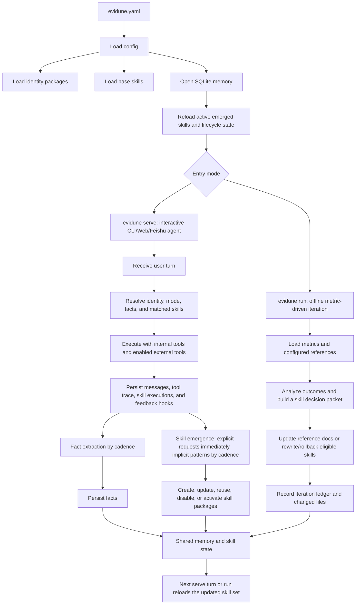

# Evidune

Outcome-driven skill self-evolution framework for AI agents.

[中文说明](README.zh-CN.md)

Evidune turns real outcomes into skill updates. It helps agents capture what
actually worked, rewrite reusable skills, and carry those improvements forward
across future runs.

## Status

Evidune is a **Developer Preview**. The default experience is a local,
self-iterating skill agent for developers. It is not a hosted service, does not
provide multi-user isolation, and should be treated as alpha software.

## Install

Prerequisites:

- Python 3.10+
- Git
- An LLM credential: `OPENAI_API_KEY`, `ANTHROPIC_API_KEY`, or `codex login`
  for the Codex provider
- Node 20 only when building or serving the web UI
- Playwright browsers only for browser E2E checks:
  `python -m playwright install chromium`

From a checkout:

```bash
git clone https://github.com/Evidune/Evidune.git
cd Evidune
pip install -e ".[all,dev]"
```

Or install into `~/.evidune` with a launcher at `~/.local/bin/evidune`:

```bash
curl -fsSL https://raw.githubusercontent.com/Evidune/Evidune/main/install.sh | sh
```

If you prefer GitHub CLI:

```bash
gh repo clone Evidune/Evidune /tmp/Evidune
/tmp/Evidune/install.sh
```

## Quick Start

Scaffold a local self-iterating skill agent:

```bash
evidune init --path demo
cd demo
```

Run one offline iteration against the configured metrics:

```bash
evidune run --config evidune.yaml
```

Inspect recorded iteration runs:

```bash
evidune iterations list --config evidune.yaml
```

Start the interactive agent:

```bash
evidune serve --config evidune.yaml
```

Run the bundled generic skill-agent example from the repo root without scaffolding:

```bash
python -m core.loop run --config examples/agent/evidune.yaml
python -m core.loop iterations list --config examples/agent/evidune.yaml
```

Serve the bundled web agent profile from the repo root:

```bash
python -m core.loop serve --config examples/agent/evidune.deploy.yaml
```

The starter config uses OpenAI by default. If your first run fails before the
model call, set `OPENAI_API_KEY`, switch the generated `llm_provider`/`llm_model`
to another configured provider, or run `codex login` and use `codex`.

## How The System Runs



`evidune serve` and `evidune run` are separate entry modes that share the same
config, memory database, skill registry, and lifecycle state. `serve` handles
interactive work: it answers user turns, uses tools, records executions, extracts
facts, and creates or updates skills from explicit requests or repeated
patterns. `run` handles offline outcome iteration: it reads metrics and
reference targets, updates skill knowledge, and records an iteration ledger.

Both paths persist into the same skill state, so the next serve turn or run
reloads the improved skill set.

## Local Iteration

- `evidune init` creates a runnable generic skill agent with sample metrics, a
  `general-assistant` identity, starter skills for task execution, skill
  lifecycle work, and code implementation, plus worktree-local runtime artifacts
  under `.evidune/`.
- `evidune run` now records each iteration cycle into SQLite so you can inspect recent
  runs with `evidune iterations list` and `evidune iterations show <id>`.
- Relative runtime paths like `memory.path`, `agent.emergence.output_dir`, and
  `metrics.config.file` are resolved relative to the active `evidune.yaml`.

## Developer Preview Smoke Tests

Use these before sharing a checkout with another developer:

```bash
python scripts/smoke_tools.py --provider openai --model gpt-4o-mini
python scripts/smoke_emergence.py --provider openai --model gpt-4o-mini
```

For Codex auth instead of an API key:

```bash
codex login
python scripts/smoke_tools.py --provider codex --model gpt-5.4
python scripts/smoke_emergence.py --provider codex --model gpt-5.4
```

See [Developer Preview Smoke](docs/references/developer-preview-smoke.md) for
the interactive `evidune serve` smoke flow, expected outputs, and known limits.

## Security Model

Evidune is local-first. When `agent.tools.external_enabled` is true, the agent
can use shell, file, Python, grep/glob, and HTTP tools within the configured
runtime limits. Do not run untrusted prompts against a sensitive working tree.
Keep API keys, Codex auth files, `.env`, SQLite databases, and runtime artifacts
out of commits. See [SECURITY.md](SECURITY.md).

## Roadmap Scope

Developer Preview focuses on the generic self-iterating skill agent. Telegram
and Discord gateways, GitHub installer/release automation, hosted SaaS,
multi-user isolation, cloud monitoring, and polished marketplace-style skill
distribution are roadmap items, not first public-release commitments.

## Repository Docs

- [docs/index.md](docs/index.md) is the documentation hub
- [docs/architecture.md](docs/architecture.md) defines package boundaries
- [AGENTS.md](AGENTS.md) is the short entrypoint for coding agents
- [CONTRIBUTING.md](CONTRIBUTING.md) covers development setup and contribution workflow

## Validation

```bash
python -m pytest tests/ -v
python -m core.docs_lint
pre-commit run --all-files
cd web && npm ci && npm run build
```
