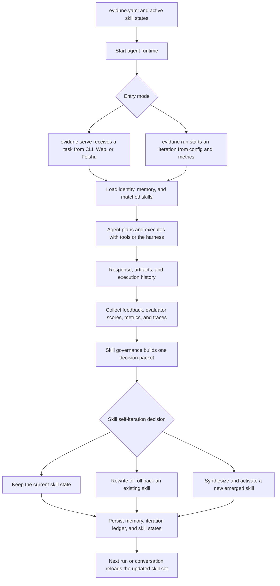

# Evidune

Outcome-driven skill self-evolution framework for AI agents.

[中文说明](README.zh-CN.md)

Evidune turns real outcomes into skill updates. It helps agents capture what
actually worked, rewrite reusable skills, and carry those improvements forward
across future runs.

## Install

Private preview installs use authenticated GitHub access and place the runtime under
`~/.evidune`, with a launcher at `~/.local/bin/evidune`.

```bash
git clone git@github.com:Evidune/Evidune.git
cd Evidune
./install.sh
```

If you prefer GitHub CLI:

```bash
gh repo clone Evidune/Evidune /tmp/Evidune
/tmp/Evidune/install.sh
```

Planned public install shape once the repo is open:

```bash
curl -fsSL https://raw.githubusercontent.com/Evidune/Evidune/main/install.sh | sh
```

## Quick Start

Scaffold a local starter project:

```bash
evidune init --path demo
cd demo
evidune run --config evidune.yaml
```

Run the bundled generic skill-agent example from the repo root:

```bash
python -m core.loop run --config examples/agent/evidune.yaml
python -m core.loop iterations list --config examples/agent/evidune.yaml
```

Start the interactive agent:

```bash
evidune run --config evidune.yaml
evidune serve --config evidune.yaml
```

## How The System Runs



At runtime, both `evidune serve` and `evidune run` load the current identity,
memory, and skill state before the agent executes work.
After execution, feedback, evaluator signals, metrics, and traces are folded
into one governance decision: keep the current skill, rewrite or roll it back,
or synthesize a new emerged skill.
That updated skill set is reloaded on the next turn or iteration, which is how
Evidune self-iterates.

## Local Iteration

- `evidune init` creates a runnable local loop with sample metrics, one identity, one
  outcome-tracked skill, and worktree-local runtime artifacts under `.evidune/`.
- `evidune run` now records each iteration cycle into SQLite so you can inspect recent
  runs with `evidune iterations list` and `evidune iterations show <id>`.
- Relative runtime paths like `memory.path`, `agent.emergence.output_dir`, and
  `metrics.config.file` are resolved relative to the active `evidune.yaml`.

## Repository Docs

- [docs/index.md](docs/index.md) is the documentation hub
- [docs/architecture.md](docs/architecture.md) defines package boundaries
- [AGENTS.md](AGENTS.md) is the short entrypoint for coding agents
- [CONTRIBUTING.md](CONTRIBUTING.md) covers development setup and contribution workflow

## Validation

```bash
python -m pytest tests/ -v
python -m core.docs_lint
pre-commit run --all-files
```
