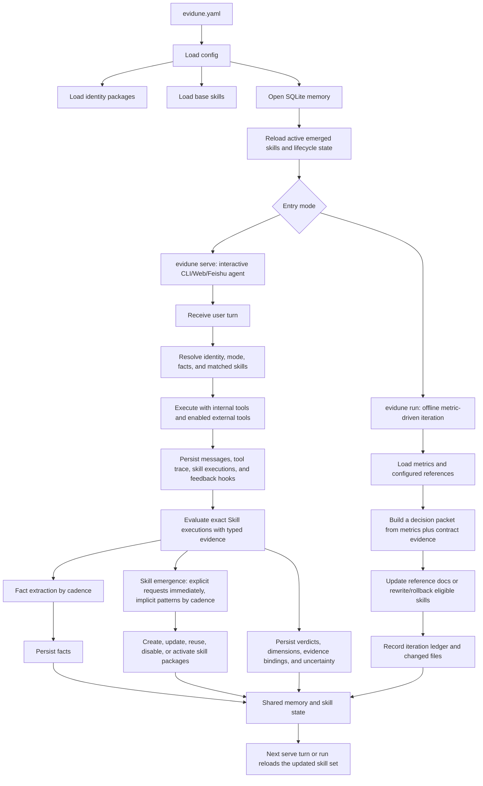
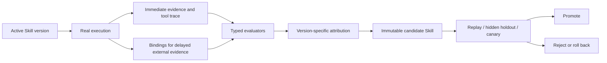

# Evidune

Outcome-driven skill self-evolution framework for AI agents.

[中文说明](README.zh-CN.md)

Evidune turns real outcomes into skill updates. It records the exact Skill
version that executed, binds immediate and delayed evidence to that execution,
and automatically replaces the active runtime Skill after review. Runtime
rewrites are observed and rolled back automatically when they regress; the
explicit `evidune eval` workflow keeps immutable candidates for replay,
holdout, and promotion experiments.

## Status

Evidune is a **Developer Preview**. The default experience is a local,
self-iterating skill agent for developers. It is not a hosted service, does not
provide multi-user isolation, and should be treated as alpha software.

Release evidence: [AppWorld 30-task repeated validation](docs/references/appworld-30-task-release-validation.md).

## Install

Prerequisites:

- Python 3.10+
- Git
- An LLM credential: `OPENAI_API_KEY`, `ANTHROPIC_API_KEY`, or `codex login`
  for the Codex provider
- Node 20 only when building or serving the web UI
- Playwright browsers only for browser E2E checks:
  `python -m playwright install chromium`

From a checkout:

```bash
git clone https://github.com/Evidune/Evidune.git
cd Evidune
pip install -e ".[all,dev]"
```

Or install into `~/.evidune` with a launcher at `~/.local/bin/evidune`:

```bash
curl -fsSL https://raw.githubusercontent.com/Evidune/Evidune/main/install.sh | sh
```

If you prefer GitHub CLI:

```bash
gh repo clone Evidune/Evidune /tmp/Evidune
/tmp/Evidune/install.sh
```

## Quick Start

Scaffold a local self-iterating skill agent:

```bash
evidune init --path demo
cd demo
```

Run one offline iteration against the configured metrics:

```bash
evidune run --config evidune.yaml
```

Inspect recorded iteration runs:

```bash
evidune iterations list --config evidune.yaml
```

Start the interactive agent:

```bash
evidune serve --config evidune.yaml
```

Run the bundled generic skill-agent example from the repo root without scaffolding:

```bash
python -m core.loop run --config examples/agent/evidune.yaml
python -m core.loop iterations list --config examples/agent/evidune.yaml
```

Serve the bundled web agent profile from the repo root:

```bash
python -m core.loop serve --config examples/agent/evidune.deploy.yaml
```

The starter config uses OpenAI by default. If your first run fails before the
model call, set `OPENAI_API_KEY`, switch the generated `llm_provider`/`llm_model`
to another configured provider, or run `codex login` and use `codex`.

## Feishu Bot Gateway

`evidune serve` can run as a Feishu/Lark bot through the official long-connection
SDK. The recommended setup uses Feishu's official
[one-click app registration](https://open.feishu.cn/document/mcp_open_tools/integrating-agents-with-feishu/overview):

```bash
pip install -e ".[feishu]"
evidune channels add feishu --one-click --config evidune.yaml
evidune serve --config evidune.yaml
```

The command opens a Feishu/Lark confirmation page, creates a bot with the
official agent permission and event preset, and configures the WebSocket gateway.
Credentials are stored in the ignored `.evidune/credentials.json` file with
`0600` permissions; `evidune.yaml` contains only environment references. Use
`--no-open-browser` to print the setup link without opening it.

The same flow is available during first-run onboarding:

```bash
evidune onboard --channel feishu --one-click --config evidune.yaml
```

For an existing manually configured app, continue to use:

```bash
export FEISHU_APP_ID=cli_xxx
export FEISHU_APP_SECRET=xxx
evidune channels add feishu \
  --app-id-env FEISHU_APP_ID \
  --app-secret-env FEISHU_APP_SECRET \
  --config evidune.yaml
```

Gateway config:

```yaml
gateways:
  - type: feishu_bot
    app_id: ${FEISHU_APP_ID}
    app_secret: ${FEISHU_APP_SECRET}
    domain: https://open.feishu.cn
    log_level: INFO
    reply_mode: card
    max_concurrency: 4
    queue_size: 100
    allowed_open_ids: []
    allowed_chat_ids: []
```

The first production scope is text input with card/text replies. Images, files,
reactions, and card action callbacks are intentionally out of scope.

## How The System Runs


```mermaid
flowchart TD
    A["evidune.yaml"] --> B["Load config"]
    B --> C["Load identity packages"]
    B --> D["Load base skills"]
    B --> E["Open SQLite memory"]
    E --> F["Reload active emerged skills and lifecycle state"]

    F --> G{"Entry mode"}

    G --> H["evidune serve: interactive CLI/Web/Feishu agent"]
    H --> I["Receive user turn"]
    I --> J["Resolve identity, mode, facts, and matched skills"]
    J --> K["Execute with internal tools and enabled external tools"]
    K --> L["Persist messages, tool trace, skill executions, and feedback hooks"]
    L --> X["Evaluate exact Skill executions with typed evidence"]
    X --> M["Fact extraction by cadence"]
    X --> N["Skill emergence: explicit requests immediately, implicit patterns by cadence"]

    G --> O["evidune run: offline metric-driven iteration"]
    O --> P["Load metrics and configured references"]
    P --> Q["Build a decision packet from metrics plus contract evidence"]
    Q --> R["Update reference docs or rewrite/rollback eligible skills"]

    M --> S["Persist facts"]
    N --> T["Create, update, reuse, disable, or activate skill packages"]
    X --> Y["Persist verdicts, dimensions, evidence bindings, and uncertainty"]
    R --> U["Record iteration ledger and changed files"]

    S --> V["Shared memory and skill state"]
    T --> V
    Y --> V
    U --> V
    V --> W["Next serve turn or run reloads the updated skill set"]
```

`evidune serve` and `evidune run` are separate entry modes that share the same
config, memory database, skill registry, evaluation contracts, and lifecycle
state. `serve` handles interactive work: it answers user turns, uses tools,
records executions, evaluates matched skills against their own contracts,
extracts facts, and creates or updates skills from explicit requests or repeated
patterns. `run` handles offline outcome iteration: it reads metrics, combines
them with contract evidence, updates skill knowledge, and records an iteration
ledger.

Both paths persist into the same skill state, so the next serve turn or run
reloads the improved skill set.

## Skill Iteration

Skills are first-class runtime objects, not just extra prompt text. A skill is a
standard package with `SKILL.md`, optional `references/*.md`, and optional
`scripts/` helpers when explicit executable code is needed. The registry loads
project skills, active generated skills, their lifecycle status, match reasons,
references, scripts, evaluation contract, and runtime metadata.

Each skill can carry an `evaluation_contract` in `SKILL.md` frontmatter. The
contract defines success criteria, observable signals, failure modes, hard
gates, optional native measurements, and sample counts for rewrite or disable
decisions. New generated skills include a contract and
`references/evaluation-contract.md`; legacy skills without a contract can have
one discovered on first matched execution and stored in SQLite or written back
when `skills.auto_update` allows it.

Evidune improves skills through two paths:

- In `evidune serve`, explicit requests like "create a reusable incident triage
  skill" enter the skill transaction path immediately. The agent decides whether
  to create, update, or reuse a skill, writes the package, activates it when it
  parses successfully, and returns `skill_creation` metadata.
- In `evidune serve`, implicit repeated patterns are checked by cadence. This
  keeps normal Q&A conservative while still letting useful workflows emerge from
  real conversations.
- In `evidune run`, metrics and configured references drive offline iteration.
  The run analyzes strong and weak outcomes plus contract evaluation evidence,
  then updates reference sections, rewrites eligible outcome-tracked skills, or
  rolls back/disable states when evidence is negative.
- All changes are persisted in SQLite and skill package files. Restarting
  `serve` reloads active generated skills and lifecycle state before the next
  turn.

Automatic synthesis only writes Markdown skill packages by default. It does not
turn generated skills into hidden executable tools; executable behavior still
comes from configured runtime tools and their security boundary. See
[docs/product-specs/skill-iteration.md](docs/product-specs/skill-iteration.md)
for the deeper product model.

## Execution-Grounded Evaluation

Normal `evidune run`, `evidune serve`, and web-feedback iteration does not wait
for a manual promotion command. An approved update atomically replaces
`SKILL.md`, increments its version, reloads the live registry, and opens an
automatic observation window. The candidate flow below is specific to explicit
`evidune eval` experiments.

Evidune does not require every domain to produce one normalized numeric score.
Evaluators return typed results such as `pass`, `fail`, `inconclusive`,
`censored`, or `invalid`, together with native dimensions, evidence references,
uncertainty, and optional scores when a numeric measurement is genuinely useful.
Safety, permission, policy, and final-state failures are hard gates; strong
latency or business metrics cannot average them away.


```mermaid
flowchart LR
    A["Active Skill version"] --> B["Real execution"]
    B --> C["Immediate evidence and tool trace"]
    B --> D["Bindings for delayed external evidence"]
    C --> E["Typed evaluators"]
    D --> E
    E --> F["Version-specific attribution"]
    F --> G["Immutable candidate Skill"]
    G --> H["Replay / hidden holdout / canary"]
    H --> I["Promote"]
    H --> J["Reject or roll back"]
```

The loop preserves the exact Skill content digest, execution id, model and tool
configuration, contracts, corpus task, evidence, and evaluator revision behind
every candidate decision. Provider outages, timeouts, malformed responses, and
environment failures remain invalid infrastructure evidence instead of being
silently counted as Skill failures.

Candidates never overwrite the active `SKILL.md` while they are being generated
or tested. Development evidence may guide a rewrite; hidden holdout and security
holdout results can accept or reject it but are excluded from future rewrite
prompts. Known-bad mutations and deterministic fault injection verify that the
configured evaluator can detect a real defect before automatic promotion is
trusted.

The repository includes commit-pinned official Skill fixtures and AppWorld
corpora under `examples/evaluation/`. To prepare the optional AppWorld
environment:

```bash
pip install -e ".[benchmarks]"
appworld install
appworld download data --root .evidune/runtime/appworld-root
appworld verify tasks --root .evidune/runtime/appworld-root
```

Sync and verify the pinned sources:

```bash
python -m core.loop eval sources sync \
  --config examples/agent/evidune.yaml \
  --base-dir . \
  --catalog examples/evaluation/official-skills.yaml
python -m core.loop eval corpus sync \
  --config examples/agent/evidune.yaml \
  --base-dir . \
  --manifest examples/evaluation/appworld-live-smoke.yaml
python -m core.loop eval corpus verify \
  --config examples/agent/evidune.yaml \
  --base-dir . \
  --manifest examples/evaluation/appworld-live-smoke.yaml
```

With a real LLM configured, a development run can stage an immutable candidate
from attributed failures. A later source-disjoint holdout run validates that
candidate and the required no-op fault:

```bash
python -m core.loop eval run \
  --config examples/agent/evidune.yaml \
  --base-dir . \
  --manifest examples/evaluation/appworld-live-smoke.yaml \
  --split development \
  --skill-path examples/evaluation/skills/appworld-operator/SKILL.md \
  --mutation skip_execution \
  --trials 6 \
  --iterate-on-failure

python -m core.loop eval run \
  --config examples/agent/evidune.yaml \
  --base-dir . \
  --manifest examples/evaluation/appworld-live-smoke.yaml \
  --split holdout \
  --skill-path examples/evaluation/skills/appworld-operator/SKILL.md \
  --experiment-id <candidate-experiment-id> \
  --mutation skip_execution \
  --trials 6
```

Replay and reports are deterministic over persisted evaluation evidence:

```bash
python -m core.loop eval replay \
  --config examples/agent/evidune.yaml \
  --base-dir . \
  --experiment-id <candidate-experiment-id>
python -m core.loop eval report \
  --config examples/agent/evidune.yaml \
  --base-dir . \
  --experiment-id <candidate-experiment-id> \
  --format markdown
```

Promotion remains an explicit lifecycle action. See
[Generalized Execution-Grounded Skill Evaluation and Iteration](docs/exec-plans/active/external-outcome-commitments.md)
for the contracts, leakage controls, mutation policy, validation layers, and
rollout status.

## Local Iteration

- `evidune init` creates a runnable generic skill agent with sample metrics, a
  `general-assistant` identity, starter skills for task execution, skill
  lifecycle work, and code implementation, plus worktree-local runtime artifacts
  under `.evidune/`.
- `evidune run` now records each iteration cycle into SQLite so you can inspect recent
  runs with `evidune iterations list` and `evidune iterations show <id>`.
- Relative runtime paths like `memory.path`, `agent.emergence.output_dir`, and
  `metrics.config.file` are resolved relative to the active `evidune.yaml`.

## Developer Preview Smoke Tests

Use these before sharing a checkout with another developer:

```bash
python scripts/smoke_tools.py --provider openai --model gpt-4o-mini
python scripts/smoke_emergence.py --provider openai --model gpt-4o-mini
```

For Codex auth instead of an API key:

```bash
codex login
python scripts/smoke_tools.py --provider codex --model gpt-5.4
python scripts/smoke_emergence.py --provider codex --model gpt-5.4
```

See [Developer Preview Smoke](docs/references/developer-preview-smoke.md) for
the interactive `evidune serve` smoke flow, expected outputs, and known limits.

## Security Model

Evidune is local-first. When `agent.tools.external_enabled` is true, the agent
can use shell, file, Python, grep/glob, and HTTP tools within the configured
runtime limits. When `agent.tools.self_management_enabled` is true, the agent
can use structured tools to read, validate, and patch `evidune.yaml`, then write
a restart request marker for a supervisor or operator. Do not run untrusted
prompts against a sensitive working tree. Keep API keys, Codex auth files,
`.env`, SQLite databases, and runtime artifacts out of commits. See
[SECURITY.md](SECURITY.md).

## Roadmap Scope

Developer Preview focuses on the generic self-iterating skill agent. Telegram
and Discord gateways, GitHub installer/release automation, hosted SaaS,
multi-user isolation, cloud monitoring, and polished marketplace-style skill
distribution are roadmap items, not first public-release commitments.

## Repository Docs

- [docs/index.md](docs/index.md) is the documentation hub
- [docs/architecture.md](docs/architecture.md) defines package boundaries
- [AGENTS.md](AGENTS.md) is the short entrypoint for coding agents
- [CONTRIBUTING.md](CONTRIBUTING.md) covers development setup and contribution workflow

## Validation

```bash
python -m pytest tests/ -v
python -m core.docs_lint
pre-commit run --all-files
cd web && npm ci && npm run build
```
