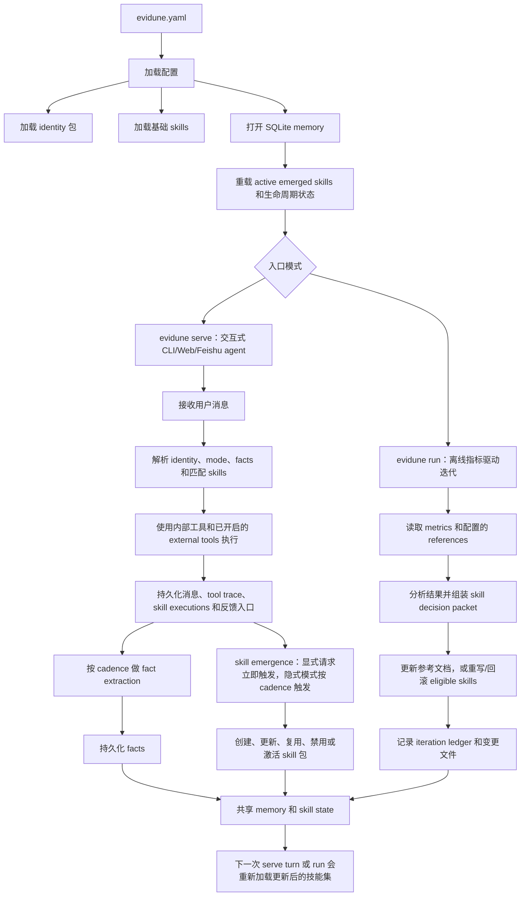

# Evidune

[English README](README.md)

Evidune 是一个面向 AI agents 的结果驱动型技能自进化框架。

它把真实运行结果转化为技能更新，让 agent 不只是完成当前任务，还能把有效做法沉淀为可复用技能，并在后续运行中持续带着这些改进前进。

## 状态

Evidune 目前是 **Developer Preview**。默认体验是给开发者本地使用的通用自迭代 skill agent。它不是托管服务，不提供多用户隔离，应按 alpha 软件对待。

## 安装

前置要求：

- Python 3.10+
- Git
- 一个 LLM 凭据：`OPENAI_API_KEY`、`ANTHROPIC_API_KEY`，或用于 Codex provider 的 `codex login`
- 只有构建或启动 Web UI 时才需要 Node 20
- 只有跑浏览器 E2E 时才需要 Playwright 浏览器：
  `python -m playwright install chromium`

从源码目录安装：

```bash
git clone https://github.com/Evidune/Evidune.git
cd Evidune
pip install -e ".[all,dev]"
```

或者安装到 `~/.evidune`，并在 `~/.local/bin/evidune` 生成启动命令：

```bash
curl -fsSL https://raw.githubusercontent.com/Evidune/Evidune/main/install.sh | sh
```

如果你更习惯 GitHub CLI：

```bash
gh repo clone Evidune/Evidune /tmp/Evidune
/tmp/Evidune/install.sh
```

## 快速开始

先初始化一个本地自迭代 skill agent：

```bash
evidune init --path demo
cd demo
```

基于配置中的指标跑一次离线迭代：

```bash
evidune run --config evidune.yaml
```

查看已记录的迭代运行：

```bash
evidune iterations list --config evidune.yaml
```

启动交互式 agent：

```bash
evidune serve --config evidune.yaml
```

不初始化项目，直接在仓库根目录运行内置通用 skill agent 示例：

```bash
python -m core.loop run --config examples/agent/evidune.yaml
python -m core.loop iterations list --config examples/agent/evidune.yaml
```

在仓库根目录启动内置 Web agent profile：

```bash
python -m core.loop serve --config examples/agent/evidune.deploy.yaml
```

starter config 默认使用 OpenAI。如果第一次运行在模型调用前失败，设置
`OPENAI_API_KEY`，把生成的 `llm_provider`/`llm_model` 改成另一个已配置
provider，或先运行 `codex login` 再使用 `codex`。

## 系统如何运行



`evidune serve` 和 `evidune run` 是两种独立入口，但共享同一套 config、memory database、skill registry 和生命周期状态。`serve` 处理交互任务：回答用户消息、使用工具、记录执行、抽取事实，并根据显式请求或重复模式创建/更新 skill。`run` 处理离线结果迭代：读取指标和参考文档目标，更新 skill 知识，并记录 iteration ledger。

两条路径最终都会写入同一份 skill state，所以下一次 serve turn 或 run 都会重新加载改进后的技能集。

## 本地迭代

- `evidune init` 会生成一个可运行的通用 skill agent，包含示例指标、`general-assistant` identity，以及任务执行、skill 生命周期、代码实现等 starter skills，并把运行产物放在 `.evidune/` 下。
- `evidune run` 会把每次迭代结果记录进 SQLite，可通过 `evidune iterations list` 和 `evidune iterations show <id>` 查看最近运行。
- `memory.path`、`agent.emergence.output_dir`、`metrics.config.file` 这类相对路径都相对于当前 `evidune.yaml` 解析。

## Developer Preview 冒烟测试

分享给其他开发者之前，建议先跑：

```bash
python scripts/smoke_tools.py --provider openai --model gpt-4o-mini
python scripts/smoke_emergence.py --provider openai --model gpt-4o-mini
```

如果使用 Codex auth 而不是 API key：

```bash
codex login
python scripts/smoke_tools.py --provider codex --model gpt-5.4
python scripts/smoke_emergence.py --provider codex --model gpt-5.4
```

交互式 `evidune serve` 的冒烟流程、预期输出和已知限制见 [Developer Preview Smoke](docs/references/developer-preview-smoke.md)。

## 安全模型

Evidune 默认本地优先。`agent.tools.external_enabled` 为 true 时，agent 可以在配置限制内使用 shell、文件、Python、grep/glob 和 HTTP 工具。不要在敏感工作区里运行不可信 prompt。API keys、Codex auth 文件、`.env`、SQLite 数据库和运行产物都不应提交。详见 [SECURITY.md](SECURITY.md)。

## 路线图边界

Developer Preview 聚焦通用自迭代 skill agent。Telegram/Discord gateway、GitHub installer/release 自动化、托管 SaaS、多用户隔离、云监控、marketplace 风格的 skill 分发都属于 roadmap，不是首个公开版本承诺。

## 仓库文档

- [docs/index.md](docs/index.md) 是文档入口
- [docs/architecture.md](docs/architecture.md) 定义包边界与依赖方向
- [AGENTS.md](AGENTS.md) 是面向 coding agents 的仓库入口说明
- [CONTRIBUTING.md](CONTRIBUTING.md) 说明开发环境与协作流程

## 校验

```bash
python -m pytest tests/ -v
python -m core.docs_lint
pre-commit run --all-files
cd web && npm ci && npm run build
```
