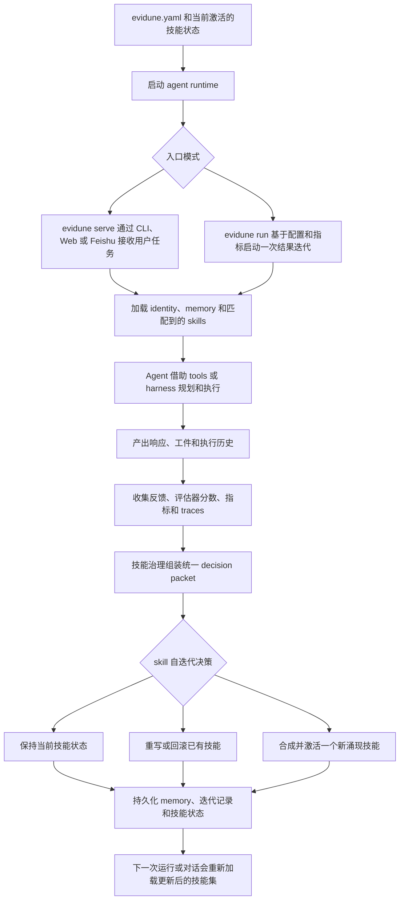

# Evidune

[English README](README.md)

Evidune 是一个面向 AI agents 的结果驱动型技能自进化框架。

它把真实运行结果转化为技能更新，让 agent 不只是完成当前任务，还能把有效做法沉淀为可复用技能，并在后续运行中持续带着这些改进前进。

## 安装

当前私有预览阶段通过带认证的 GitHub 访问安装，运行时默认放在 `~/.evidune`，并在 `~/.local/bin/evidune` 生成启动命令。

```bash
git clone git@github.com:Evidune/Evidune.git
cd Evidune
./install.sh
```

如果你更习惯 GitHub CLI：

```bash
gh repo clone Evidune/Evidune /tmp/Evidune
/tmp/Evidune/install.sh
```

仓库公开后的目标安装形式：

```bash
curl -fsSL https://raw.githubusercontent.com/Evidune/Evidune/main/install.sh | sh
```

## 快速开始

先初始化一个本地 starter project：

```bash
evidune init --path demo
cd demo
evidune run --config evidune.yaml
```

在仓库根目录直接运行内置的内容写作示例：

```bash
python -m core.loop run --config examples/content/evidune.yaml
python -m core.loop iterations list --config examples/content/evidune.yaml
```

启动交互式 agent：

```bash
evidune run --config evidune.yaml
evidune serve --config evidune.yaml
```

## 系统如何运行



运行时，`evidune serve` 和 `evidune run` 都会先加载当前 identity、memory 和技能状态，再进入 agent 执行阶段。
执行结束后，反馈、评估信号、指标和 traces 会汇入同一条技能治理链路，决定是保持现状、重写或回滚已有技能，还是合成一个新技能。
下一轮运行会重新加载这批更新后的技能，这就是 Evidune 的 skill 自迭代方式。

## 本地迭代

- `evidune init` 会生成一个可运行的本地闭环项目，包含示例指标、一个 identity、一个 outcome-tracked skill，以及位于 `.evidune/` 下的本地运行产物。
- `evidune run` 会把每次迭代结果记录进 SQLite，可通过 `evidune iterations list` 和 `evidune iterations show <id>` 查看最近运行。
- `memory.path`、`agent.emergence.output_dir`、`metrics.config.file` 这类相对路径都相对于当前 `evidune.yaml` 解析。

## 仓库文档

- [docs/index.md](docs/index.md) 是文档入口
- [docs/architecture.md](docs/architecture.md) 定义包边界与依赖方向
- [AGENTS.md](AGENTS.md) 是面向 coding agents 的仓库入口说明
- [CONTRIBUTING.md](CONTRIBUTING.md) 说明开发环境与协作流程

## 校验

```bash
python -m pytest tests/ -v
python -m core.docs_lint
pre-commit run --all-files
```
