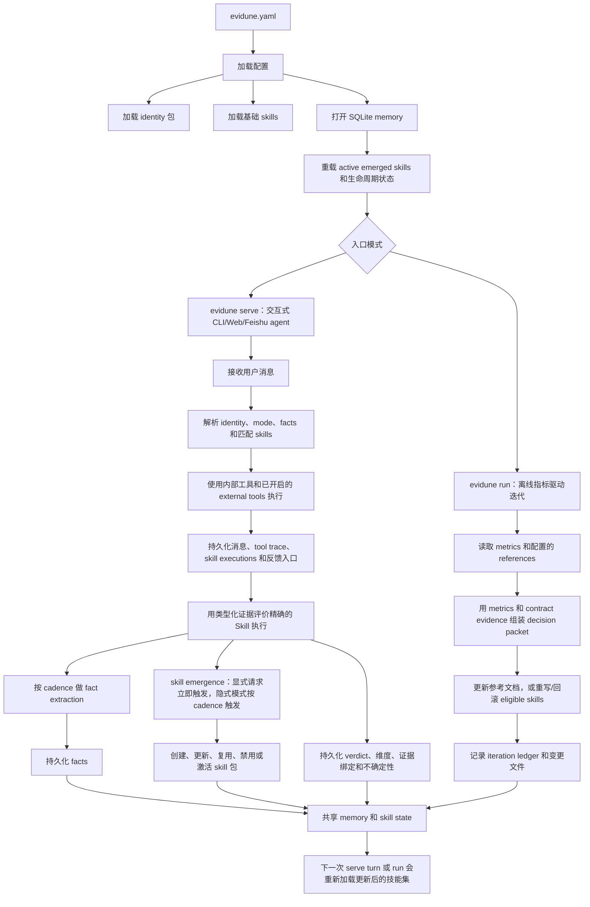
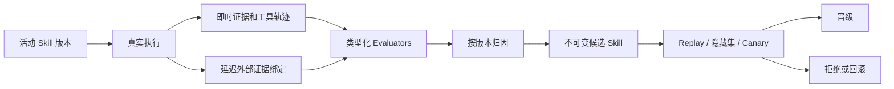

# Evidune

[English README](README.md)

Evidune 是一个面向 AI agents 的结果驱动型技能自进化框架。

它把真实运行结果转化为技能更新：记录实际执行的精确 Skill 版本，把即时和延迟证据绑定到该次执行，并在运行时审查通过后自动替换活动 Skill。新版本会被自动观察，发生退化时自动回滚；显式 `evidune eval` 仍保留不可变候选、replay、holdout 和晋级实验。

## 状态

Evidune 目前是 **Developer Preview**。默认体验是给开发者本地使用的通用自迭代 skill agent。它不是托管服务，不提供多用户隔离，应按 alpha 软件对待。

发布验证证据：[AppWorld 30 任务重复发布验证报告](docs/references/appworld-30-task-release-validation.zh-CN.md)。

## 安装

前置要求：

- Python 3.10+
- Git
- 一个 LLM 凭据：`OPENAI_API_KEY`、`ANTHROPIC_API_KEY`，或用于 Codex provider 的 `codex login`
- 只有构建或启动 Web UI 时才需要 Node 20
- 只有跑浏览器 E2E 时才需要 Playwright 浏览器：
  `python -m playwright install chromium`

从源码目录安装：

```bash
git clone https://github.com/Evidune/Evidune.git
cd Evidune
pip install -e ".[all,dev]"
```

或者安装到 `~/.evidune`，并在 `~/.local/bin/evidune` 生成启动命令：

```bash
curl -fsSL https://raw.githubusercontent.com/Evidune/Evidune/main/install.sh | sh
```

如果你更习惯 GitHub CLI：

```bash
gh repo clone Evidune/Evidune /tmp/Evidune
/tmp/Evidune/install.sh
```

## 快速开始

先初始化一个本地自迭代 skill agent：

```bash
evidune init --path demo
cd demo
```

基于配置中的指标跑一次离线迭代：

```bash
evidune run --config evidune.yaml
```

查看已记录的迭代运行：

```bash
evidune iterations list --config evidune.yaml
```

启动交互式 agent：

```bash
evidune serve --config evidune.yaml
```

不初始化项目，直接在仓库根目录运行内置通用 skill agent 示例：

```bash
python -m core.loop run --config examples/agent/evidune.yaml
python -m core.loop iterations list --config examples/agent/evidune.yaml
```

在仓库根目录启动内置 Web agent profile：

```bash
python -m core.loop serve --config examples/agent/evidune.deploy.yaml
```

starter config 默认使用 OpenAI。如果第一次运行在模型调用前失败，设置
`OPENAI_API_KEY`，把生成的 `llm_provider`/`llm_model` 改成另一个已配置
provider，或先运行 `codex login` 再使用 `codex`。

## 飞书机器人

Evidune 支持飞书官方的
[一键创建飞书智能体应用](https://open.feishu.cn/document/mcp_open_tools/integrating-agents-with-feishu/overview)：

```bash
pip install -e ".[feishu]"
evidune channels add feishu --one-click --config evidune.yaml
evidune serve --config evidune.yaml
```

命令会打开飞书或 Lark 确认页面，自动创建机器人、预置权限和事件订阅，并配置
WebSocket 长连接。凭据保存在 Git 已忽略、权限为 `0600` 的
`.evidune/credentials.json` 中；`evidune.yaml` 只保存环境变量引用。无浏览器环境
可加 `--no-open-browser`，复制终端中的链接完成确认。

首次配置模型时也可以直接运行：

```bash
evidune onboard --channel feishu --one-click --config evidune.yaml
```

## 系统如何运行


```mermaid
flowchart TD
    A["evidune.yaml"] --> B["加载配置"]
    B --> C["加载 identity 包"]
    B --> D["加载基础 skills"]
    B --> E["打开 SQLite memory"]
    E --> F["重载 active emerged skills 和生命周期状态"]

    F --> G{"入口模式"}

    G --> H["evidune serve：交互式 CLI/Web/Feishu agent"]
    H --> I["接收用户消息"]
    I --> J["解析 identity、mode、facts 和匹配 skills"]
    J --> K["使用内部工具和已开启的 external tools 执行"]
    K --> L["持久化消息、tool trace、skill executions 和反馈入口"]
    L --> X["用类型化证据评价精确的 Skill 执行"]
    X --> M["按 cadence 做 fact extraction"]
    X --> N["skill emergence：显式请求立即触发，隐式模式按 cadence 触发"]

    G --> O["evidune run：离线指标驱动迭代"]
    O --> P["读取 metrics 和配置的 references"]
    P --> Q["用 metrics 和 contract evidence 组装 decision packet"]
    Q --> R["更新参考文档，或重写/回滚 eligible skills"]

    M --> S["持久化 facts"]
    N --> T["创建、更新、复用、禁用或激活 skill 包"]
    X --> Y["持久化 verdict、维度、证据绑定和不确定性"]
    R --> U["记录 iteration ledger 和变更文件"]

    S --> V["共享 memory 和 skill state"]
    T --> V
    Y --> V
    U --> V
    V --> W["下一次 serve turn 或 run 会重新加载更新后的技能集"]
```

`evidune serve` 和 `evidune run` 是两种独立入口，但共享同一套 config、memory database、skill registry、evaluation contracts 和生命周期状态。`serve` 处理交互任务：回答用户消息、使用工具、记录执行、按 skill 自己的 contract 评价结果、抽取事实，并根据显式请求或重复模式创建/更新 skill。`run` 处理离线结果迭代：读取指标，把它们和 contract evidence 合并进决策包，更新 skill 知识，并记录 iteration ledger。

两条路径最终都会写入同一份 skill state，所以下一次 serve turn 或 run 都会重新加载改进后的技能集。

## Skill 迭代

Skill 是运行时的一等对象，不只是附加 prompt。一个 skill 是标准包：
`SKILL.md` 加可选的 `scripts/*.md` 和 `references/*.md`。Registry 会加载项目
skills、active generated skills、生命周期状态、匹配原因、references、scripts、
evaluation contract 和运行时元数据。

每个 skill 都可以在 `SKILL.md` frontmatter 中带 `evaluation_contract`。这个契约
定义成功标准、可观测信号、失败模式、硬门槛、可选的原生数值，以及触发
rewrite/disable 需要的样本数。新生成的 skill 会自带 contract 和
`references/evaluation-contract.md`；旧 skill 第一次被匹配执行且缺少 contract
时，会自动发现 runtime contract，并在 `skills.auto_update` 允许时写回
`SKILL.md`，否则只落 SQLite。

Evidune 通过两条路径改进 skill：

- 在 `evidune serve` 中，用户明确说“创建一个可复用 incident triage skill”
  这类请求时，会立即进入 skill transaction。Agent 会判断应该创建、更新还是复用
  skill；写入 skill 包；解析成功后激活；并在响应里返回 `skill_creation` metadata。
- 在 `evidune serve` 中，隐式重复模式按 cadence 检测。这样普通问答不会过度生成
  skill，但真实对话里反复出现的有效 workflow 仍然可以沉淀。
- 在 `evidune run` 中，metrics、配置的 references 和 contract evaluation evidence
  共同驱动离线迭代。系统会分析好坏 outcome，更新 reference sections，重写
  eligible outcome-tracked skills，或在负面证据足够时回滚/禁用。
- 所有变化都会持久化到 SQLite 和 skill 包文件。`serve` 重启后，会在下一轮对话前
  重新加载 active generated skills 和生命周期状态。

自动合成默认只写 Markdown skill 包，不会把生成的 skill 偷偷变成可执行工具；可执行能力
仍来自已配置的 runtime tools 及其安全边界。更完整的产品模型见
[docs/product-specs/skill-iteration.md](docs/product-specs/skill-iteration.md)。

## 基于真实执行的评价闭环

普通的 `evidune run`、`evidune serve` 和 Web 反馈迭代不再等待用户手动晋级。
审查通过后会原子替换 `SKILL.md`、递增版本、立即重载运行时 registry，并进入自动
观察窗口。下面的候选流程仅用于显式 `evidune eval` 实验。

Evidune 不要求所有领域都压缩成一个归一化数值分数。Evaluator 返回
`pass`、`fail`、`inconclusive`、`censored` 或 `invalid` 等类型化结果，并携带
原生维度、证据引用、不确定性；只有指标本身适合数值化时才使用可选 score。安全、
权限、策略和最终状态失败属于硬门槛，不能被更好的延迟、成本或业务指标平均抵消。


```mermaid
flowchart LR
    A["活动 Skill 版本"] --> B["真实执行"]
    B --> C["即时证据和工具轨迹"]
    B --> D["延迟外部证据绑定"]
    C --> E["类型化 Evaluators"]
    D --> E
    E --> F["按版本归因"]
    F --> G["不可变候选 Skill"]
    G --> H["Replay / 隐藏集 / Canary"]
    H --> I["晋级"]
    H --> J["拒绝或回滚"]
```

闭环会保留每次候选决策背后的精确 Skill 内容摘要、execution id、模型与工具配置、
契约、语料任务、证据和 evaluator revision。Provider 故障、超时、无效响应和环境
不可用会作为无效基础设施证据保存，不会静默算成 Skill 失败。

候选在生成和测试期间不会覆盖活动 `SKILL.md`。Development 证据可以指导重写；
隐藏 holdout 和 security holdout 只负责接受或拒绝候选，结果不会进入未来重写
prompt。已知坏变异和确定性故障注入用于证明评价器确实能发现缺陷，然后才值得信任
自动晋级。

仓库在 `examples/evaluation/` 下提供了 commit-pinned 官方 Skill fixtures 和
AppWorld 语料。准备可选 AppWorld 环境：

```bash
pip install -e ".[benchmarks]"
appworld install
appworld download data --root .evidune/runtime/appworld-root
appworld verify tasks --root .evidune/runtime/appworld-root
```

同步并验证固定来源：

```bash
python -m core.loop eval sources sync \
  --config examples/agent/evidune.yaml \
  --base-dir . \
  --catalog examples/evaluation/official-skills.yaml
python -m core.loop eval corpus sync \
  --config examples/agent/evidune.yaml \
  --base-dir . \
  --manifest examples/evaluation/appworld-live-smoke.yaml
python -m core.loop eval corpus verify \
  --config examples/agent/evidune.yaml \
  --base-dir . \
  --manifest examples/evaluation/appworld-live-smoke.yaml
```

配置真实 LLM 后，development 运行可以根据可归因失败创建不可变候选；随后使用
来源不重叠的 holdout 验证候选以及必需的 no-op 故障：

```bash
python -m core.loop eval run \
  --config examples/agent/evidune.yaml \
  --base-dir . \
  --manifest examples/evaluation/appworld-live-smoke.yaml \
  --split development \
  --skill-path examples/evaluation/skills/appworld-operator/SKILL.md \
  --mutation skip_execution \
  --trials 6 \
  --iterate-on-failure

python -m core.loop eval run \
  --config examples/agent/evidune.yaml \
  --base-dir . \
  --manifest examples/evaluation/appworld-live-smoke.yaml \
  --split holdout \
  --skill-path examples/evaluation/skills/appworld-operator/SKILL.md \
  --experiment-id <candidate-experiment-id> \
  --mutation skip_execution \
  --trials 6
```

Replay 和报告基于已持久化的评价证据确定性生成：

```bash
python -m core.loop eval replay \
  --config examples/agent/evidune.yaml \
  --base-dir . \
  --experiment-id <candidate-experiment-id>
python -m core.loop eval report \
  --config examples/agent/evidune.yaml \
  --base-dir . \
  --experiment-id <candidate-experiment-id> \
  --format markdown
```

晋级仍是显式生命周期操作。契约、数据泄漏控制、变异策略、验证分层和当前 rollout
状态见
[通用执行证据驱动的 Skill 评价与迭代设计](docs/exec-plans/active/external-outcome-commitments.md)。

## 本地迭代

- `evidune init` 会生成一个可运行的通用 skill agent，包含示例指标、`general-assistant` identity，以及任务执行、skill 生命周期、代码实现等 starter skills，并把运行产物放在 `.evidune/` 下。
- `evidune run` 会把每次迭代结果记录进 SQLite，可通过 `evidune iterations list` 和 `evidune iterations show <id>` 查看最近运行。
- `memory.path`、`agent.emergence.output_dir`、`metrics.config.file` 这类相对路径都相对于当前 `evidune.yaml` 解析。

## Developer Preview 冒烟测试

分享给其他开发者之前，建议先跑：

```bash
python scripts/smoke_tools.py --provider openai --model gpt-4o-mini
python scripts/smoke_emergence.py --provider openai --model gpt-4o-mini
```

如果使用 Codex auth 而不是 API key：

```bash
codex login
python scripts/smoke_tools.py --provider codex --model gpt-5.4
python scripts/smoke_emergence.py --provider codex --model gpt-5.4
```

交互式 `evidune serve` 的冒烟流程、预期输出和已知限制见 [Developer Preview Smoke](docs/references/developer-preview-smoke.md)。

## 安全模型

Evidune 默认本地优先。`agent.tools.external_enabled` 为 true 时，agent 可以在配置限制内使用 shell、文件、Python、grep/glob 和 HTTP 工具。不要在敏感工作区里运行不可信 prompt。API keys、Codex auth 文件、`.env`、SQLite 数据库和运行产物都不应提交。详见 [SECURITY.md](SECURITY.md)。

## 路线图边界

Developer Preview 聚焦通用自迭代 skill agent。Telegram/Discord gateway、GitHub installer/release 自动化、托管 SaaS、多用户隔离、云监控、marketplace 风格的 skill 分发都属于 roadmap，不是首个公开版本承诺。

## 仓库文档

- [docs/index.md](docs/index.md) 是文档入口
- [docs/architecture.md](docs/architecture.md) 定义包边界与依赖方向
- [AGENTS.md](AGENTS.md) 是面向 coding agents 的仓库入口说明
- [CONTRIBUTING.md](CONTRIBUTING.md) 说明开发环境与协作流程

## 校验

```bash
python -m pytest tests/ -v
python -m core.docs_lint
pre-commit run --all-files
cd web && npm ci && npm run build
```
