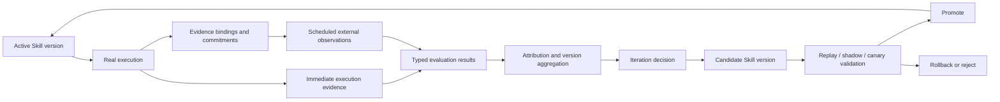

# Generalized Execution-Grounded Skill Evaluation and Iteration

- Title: Generalized evaluation and automatic Skill iteration grounded in real executions
- Owner: Evidune core maintainers
- Driving area: `core/`, `agent/`, `memory/`, `skills/`, `adapters/`
- Status: active

## Goal

Build one generalized evaluation system that closes the loop between what a Skill
actually did and how that Skill changes over time:

1. a concrete Skill version runs and creates an immutable execution record
2. immediate execution evidence and delayed external evidence link to that execution
3. typed evaluators produce structured verdicts without requiring one universal score
4. evidence is attributed and aggregated at the Skill-version level
5. explicit `evidune eval` regressions create a candidate Skill version without
   mutating the active version
6. replay, shadow, or canary validation promotes or rejects that evaluation candidate
7. normal `run`, `serve`, and web-feedback iteration atomically replaces the active
   runtime Skill, then automatically confirms it or restores the prior version from
   post-rewrite evidence

Deploy stability, recommendation performance, and published-content engagement are
illustrative cases only. They must use the same execution, evidence, evaluation, and
iteration protocol as any future domain; they do not define the schema.

## Success Criteria

- Every automatic Skill change can identify the exact execution ids and evidence that
  caused it.
- Immediate and delayed evaluations are joined by `execution_id` and `skill_version`,
  not loosely grouped by Skill name.
- Evaluators can return booleans, enums, state differences, events, native metrics, or
  advisory judgments. A normalized numeric score is optional.
- Hard safety, permission, and correctness failures cannot be offset by strong latency,
  cost, or business metrics.
- Explicit `evidune eval` iteration never rewrites the active Skill in place; it uses a
  candidate version with validation, promotion, and rollback evidence.
- Runtime self-iteration requires no manual promotion: approved updates atomically replace
  `SKILL.md`, increment the version, reload the live registry, and enter an automatic
  observation window.
- Adding a new domain normally requires a declarative contract and an allowlisted probe
  or evaluator, not a new domain-specific orchestration path.
- A pinned real-world corpus can pair third-party Skills with executable tasks while
  preserving source, license, environment, model, and evaluator provenance.
- At least one automatic iteration pilot demonstrates that Evidune detects a known Skill
  defect, proposes a candidate, and recovers on a hidden real-LLM holdout without a new
  hard-gate regression.

## Non-Goals

- One universal scalar reward for every Skill and domain
- Full causal inference from arbitrary observational data
- Giving the evaluated Skill authority to rewrite its active evaluator or historical
  contracts
- Letting background probes reuse unrestricted shell, Python, or file-write tools
- Making an LLM judge a required or authoritative dependency
- Replacing external observability, experiment, or business analytics platforms

## Current State

- `skill_executions` now snapshots Skill version/digest, contracts, model identity, tool
  traces, artifacts, corpus/task identity, variant, and experiment lineage.
- Typed `EvaluationResult` records support pass, fail, inconclusive, censored, and invalid
  verdicts with optional scores, hard gates, uncertainty, attribution, and evidence refs.
- Durable evidence bindings link exact executions to entities and delayed observation
  plans; leased read-only probes persist attempts and immutable observations before
  deterministic evaluation.
- Version-specific aggregation reports contributing and excluded execution ids instead of
  pooling by Skill name.
- Explicit `evidune eval` iteration stages immutable candidate content in a
  `SkillVersionExperiment`; the active `SKILL.md` remains unchanged until validation and
  promotion.
- Runtime `run`, `serve`, and web-feedback iteration applies reviewed changes directly,
  preserves the previous full content in lifecycle history, and automatically confirms or
  rolls back the new version.
- `EvaluationCorpus`, fixture and AppWorld adapters, real-LLM executors, replay, JSON,
  Markdown, and JUnit artifacts, seven known-bad mutation operators, and lifecycle commands
  are implemented.
- Official OpenAI, Anthropic, and Hugging Face Skill sources are commit-pinned and paired
  with reviewed, source-matched executable fixtures. Catalog validation rejects an
  `approved` label unless the fixture manifest, task ids, source URL, commit, Skill path,
  and pairing all agree.
- AppWorld `0.1.3.post1` is installed in an isolated Python 3.11 environment. Its 1,553 app
  tests pass, 30/31 package tests pass (the remaining remote-mode assertion is a local
  proxy-message mismatch), and all 147 packaged tasks verify. A pinned 30-task manifest
  and a source-disjoint three-task live slice are available. Both manifests declare the
  isolated `.evidune/runtime/appworld-root` data root. The full 30-task repeated V4
  live-LLM run is complete: development rejected the candidate, holdout was inconclusive,
  replay failed, and production V5 canary remains a future release gate.

## Implementation Status (2026-07-16)

| Capability                                        | Status      | Evidence                                                                                                                                                                                                                                        |
| ------------------------------------------------- | ----------- | ----------------------------------------------------------------------------------------------------------------------------------------------------------------------------------------------------------------------------------------------- |
| Execution and contract lineage                    | implemented | SQLite schema, immutable snapshots, execution reconstruction tests                                                                                                                                                                              |
| Typed score-optional governance                   | implemented | deterministic hard-gate policy and invalid/inconclusive handling                                                                                                                                                                                |
| Binding, probe, lease, and delayed observation    | implemented | allowlisted read-only registry, idempotent scheduler, retry tests                                                                                                                                                                               |
| Version aggregation and attribution               | implemented | version/contract grouping with contributing and excluded execution ids                                                                                                                                                                          |
| Candidate, replay, promotion, rejection, rollback | implemented | immutable candidate plus digest, provenance, and holdout promotion gates                                                                                                                                                                        |
| Runtime automatic replacement and observation     | implemented | atomic active-file replacement, version bump, live registry reload, post-rewrite confirmation, and automatic restore                                                                                                                            |
| Corpus, adapter, reports, and mutation tests      | implemented | fixture/AppWorld contracts, JSON/Markdown/JUnit bundles, seven mutation operators                                                                                                                                                               |
| Real-LLM smoke                                    | validated   | Codex `gpt-5.4`, experiment `exp_bb0b251ffcac4a31b891fc38d7b2ba70`, 2/2 valid trials                                                                                                                                                            |
| Official third-party Skill fixtures               | validated   | three source-matched pairings; real-LLM experiments `exp_201b12aea1cd48e5a82045c5ee08912d`, `exp_c32e364a8d634db99cf1c4adcf7beb6d`, `exp_a147935a24ff4435a33ec6bd478c4816`                                                                      |
| Real AppWorld 30-task V4 release validation       | completed   | development `exp_1636f1d0fadc40c19d8428680c450643` rejected the candidate; holdout `exp_39baa4b7312c4b3a837e2fe9c9a7812a` was inconclusive and replay failed; see [the release report](../../references/appworld-30-task-release-validation.md) |
| Production shadow/canary delayed-outcome pilot    | pending     | reserved for a future candidate that first passes V4, with bounded exposure and rollback policy                                                                                                                                                 |

The fixture smokes use deterministic state/output evaluators; the model does not judge its
own result. The AppWorld track uses AppWorld's database-state evaluator and requires an
explicit `complete_task` call. Provider timeouts, connection failures, and a prior OpenAI
API `429 insufficient_quota` are stored as invalid external-dependency evidence rather
than negative Skill evidence. Extra attempts may satisfy a declared minimum-valid-trial
count; execution stops once the minimum is reached or becomes impossible. Per-model-call,
tool-call, model-turn, and total trial wall-time budgets prevent one noisy trial from
stalling the batch indefinitely.

## Design Principles

### 1. The execution is the unit of evidence

`execution_id` is the primary join key for evaluation. `skill_name` is an aggregation
dimension, not sufficient provenance.

Each execution must snapshot:

- Skill name, version, and content digest
- execution and outcome contract versions and digests
- conversation or harness task id
- relevant inputs, outputs, tool trace, and artifact references
- start and completion timestamps
- created external entities or interventions

### 2. Keep immediate and delayed contracts distinct

The existing separation remains useful:

- `execution_contract`: immediate correctness, process, safety, and tool-use evidence
- `outcome_contract`: delayed external state, events, and business measurements

They join only in `GovernanceEvidence`, keyed by execution and Skill version. Neither
contract is collapsed into the other.

### 3. Evaluation is typed; numeric scoring is optional

The common interface is a structured result, not a mandatory `0..1` reward:

```yaml
verdict: pass # pass | fail | inconclusive | censored | invalid
score: null # optional and meaningful only for this evaluator
uncertainty: low
dimensions:
  task_completed: true
  safety_violation: false
  expected_state_reached: true
  latency_ms: 1250
failure_modes: []
evidence_refs:
  - evidence://probe-attempt/42
```

Native measurements stay native. A duration remains a duration, a rollback event remains
an event, and an invariant remains a boolean. Counts, rates, confidence intervals, or
scores may be computed when the measurement design supports them.

### 4. Hard gates do not average with optimization metrics

Governance evaluates dimensions in this order:

1. safety, permissions, policy, and irreversible-side-effect invariants
2. task completion or expected final state
3. delayed outcome evidence and attribution quality
4. cost, latency, token use, and other optimization metrics

A failure at level 1 or 2 cannot be compensated by a weighted average from a later level.
Optimization metrics rank otherwise acceptable candidates; they do not redefine success.

### 5. Evaluators are pluggable implementations

| Evaluator type   | Appropriate evidence                                      |
| ---------------- | --------------------------------------------------------- |
| `predicate`      | Boolean or enum conditions over structured data           |
| `state_diff`     | Expected and forbidden changes in an external system      |
| `event`          | Rollback, complaint, error, approval, or timeout events   |
| `metric`         | Native continuous, count, rate, or ratio measurements     |
| `distribution`   | Aggregated behavior over comparable executions            |
| `trace`          | Tool use, permissions, required steps, and budgets        |
| `human_feedback` | Explicit user or reviewer decisions                       |
| `llm_judge`      | Advisory semantic judgment when structure is insufficient |

All evaluators return the same `EvaluationResult` envelope. Domain-specific logic lives
inside declarative contracts or evaluator plugins, not in the iteration orchestrator.

### 6. Uncertainty and missing evidence are first-class outcomes

- Probe failure is retryable operational state, never negative Skill evidence.
- Missing or malformed data produces `invalid` or `inconclusive`, not score `0`.
- A horizon that cannot be observed produces `censored` with a reason.
- An LLM judge disagreement or uncalibrated result remains advisory.
- Automatic mutation requires both sufficient evidence and sufficient attribution.

### 7. Evaluation definitions are immutable for an execution

The contract, probe specification, extraction rule, and evaluator revision are snapshotted
when the execution creates its binding. A Skill or candidate rewrite may propose version
`N+1` for future executions, but cannot change the success definition for in-flight or
historical evidence.

## End-to-End Closed Loop



The closed loop must preserve traceability in both directions:

```text
skill_version
  -> skill_execution.id
  -> evidence_binding.execution_id
  -> observation.binding_id
  -> evaluation_result.execution_id
  -> iteration_decision.source_execution_ids
  -> candidate_skill_version
  -> validation evidence
  -> promotion or rollback event
```

## Core Abstractions

| Abstraction              | Responsibility                                                    |
| ------------------------ | ----------------------------------------------------------------- |
| `SkillExecution`         | Immutable record of one real Skill-version execution              |
| `EvaluationContract`     | Versioned criteria and governance policy snapshot                 |
| `EvidenceBinding`        | Links an execution to an entity, intervention, or future evidence |
| `ObservationPlan`        | Probe, extraction, horizons, retry, and maturity semantics        |
| `Observation`            | An immutable fact observed immediately or later                   |
| `EvaluationResult`       | Typed verdict, dimensions, uncertainty, failures, and evidence    |
| `GovernanceEvidence`     | Execution and outcome results combined without losing provenance  |
| `IterationDecision`      | Evidence-backed proposal, no-op, disable, or rollback decision    |
| `SkillVersionExperiment` | Candidate validation, comparison, promotion, and rollback         |
| `EvaluationCorpus`       | Pinned Skills, tasks, splits, licenses, and environment manifests |
| `BenchmarkAdapter`       | Maps an external task world into executions and typed evidence    |

The previous `Commitment + Probe + Schedule + Scorer` four-tuple remains as the delayed
external-evidence sub-protocol inside `EvidenceBinding` and `ObservationPlan`. It is not
the top-level Skill evaluation model.

## Real-World Skill and Benchmark Corpus

Real Skills and benchmark tasks are normally published separately. Evidune must pair
them explicitly instead of assuming that a benchmark ships the Skill being evaluated:

```text
pinned Skill source + executable task world + versioned evaluator
  -> EvaluationCorpus
  -> real Skill execution
  -> EvaluationResult and candidate lifecycle
```

The corpus is validation input, not a new architecture layer. Each source is imported
through a small adapter and produces the same execution, trace, state-diff, evaluation,
and iteration records as a locally authored Skill.

### Initial source set

| Source                                                       | Role in the corpus                                                                      | Intended use                                                                   |
| ------------------------------------------------------------ | --------------------------------------------------------------------------------------- | ------------------------------------------------------------------------------ |
| [OpenAI Plugins](https://github.com/openai/plugins)          | Current official plugin catalog with real workflow Skills                               | Triggering, tool choice, required behavior, and fixture-to-contract conversion |
| [Anthropic Skills](https://github.com/anthropics/skills)     | Real document, technical, and enterprise Skills with an established evaluation workflow | With-Skill versus baseline comparison, trigger tests, and output assertions    |
| [Hugging Face Skills](https://github.com/huggingface/skills) | Engineering Skills with observable jobs and artifacts                                   | Long-running task and external-artifact evaluation                             |
| [AppWorld](https://github.com/StonyBrookNLP/appworld)        | Sandboxed app APIs with task-specific database state and evaluators                     | First full outcome-grounded pilot and collateral-damage checks                 |
| [tau-bench](https://github.com/sierra-research/tau2-bench)   | Multi-turn customer-service domains with policies, tools, tasks, and user simulation    | Policy compliance and shared agent-user state after the first pilot            |
| [AgentDojo](https://github.com/ethz-spylab/agentdojo)        | Tool-use tasks with prompt-injection attack cases                                       | Security regression and permission-boundary gates                              |
| [BrowserGym](https://github.com/ServiceNow/BrowserGym)       | Browser environments including verified web-task suites                                 | Later browser and long-horizon validation                                      |
| [SWE-bench Live](https://swe-bench-live.github.io/)          | Fresh real-world software issues                                                        | Later coding-Skill validation with higher setup and evaluation cost            |

The first vertical slice has two coordinated tracks: three to five pinned official Skills
run against their native or faithfully reconstructed fixtures, while AppWorld supplies a
20-to-30-task external-state corpus for Skills with a genuine capability and tool-semantic
match. Do not force an unrelated official Skill onto AppWorld merely to combine the two
sources. If no genuine match exists, keep the official-Skill and AppWorld tracks separate
until a real integration environment is available. The source table is a candidate
catalog; inclusion in a release gate requires a completed corpus manifest and
license/security review.

### Corpus manifest and source policy

Every imported corpus snapshot records:

- `corpus_id`, schema version, source URL, source commit, retrieval date, and digest
- Skill paths, original Skill digests, local compatibility patches, and patch digests
- upstream license per Skill and dataset plus redistribution restrictions
- benchmark adapter id/revision and environment image or dependency lock digest
- task ids and immutable train/development/holdout split manifests
- evaluator ids/revisions, ground-truth visibility, and expected artifact schemas
- allowed network, secrets, tools, filesystem roots, time, token, and monetary budgets

Official repositories are preferred for the initial corpus. Community Skills are
quarantined, statically reviewed, pinned to a commit, and executed in an isolated
environment before they can participate in any evaluation. Imported Skills never gain
access to host credentials merely because their source is trusted.

### Benchmark adapter contract

A `BenchmarkAdapter` must provide these operations without leaking benchmark-specific
logic into the iteration orchestrator:

```python
prepare(task_ref, split, environment_ref) -> PreparedTask
execute(prepared_task, skill_ref, model_ref, trial) -> SkillExecution
collect(execution_id) -> list[Observation]
evaluate(execution_id, evaluator_ref) -> list[EvaluationResult]
reset(prepared_task) -> ResetResult
```

`prepare` supplies only agent-visible instructions and tools. Hidden expected answers,
state predicates, evaluator code, and holdout metadata remain outside the candidate
workspace. `reset` must prove that the environment returned to its declared initial state
before another trial. Adapter output includes native benchmark results, but governance
uses typed dimensions and hard gates rather than treating a benchmark's scalar reward as
the universal Skill score.

### Pairing Skills to tasks

Pairing is declared and reviewable rather than inferred during a test run. A pairing
specifies required capabilities, applicable and non-applicable tasks, expected trigger
behavior, tool compatibility, and any adapter-only compatibility shim. A shim may adapt a
transport or schema, but it cannot change the Skill's intended workflow or make a synthetic
task appear to be a real match. The same task may run in three configurations:

1. without the Skill, when a Skill-free baseline is meaningful
2. with the current or upstream Skill version
3. with a candidate or deliberately mutated Skill version

This distinguishes Skill value from base-model capability and candidate improvement from
random run variance.

## Evidence Binding and External Observation

An execution creates a binding only when it can identify the entity or intervention that
later probes will observe. The binding snapshots:

- `execution_id`, `skill_name`, `skill_version`, and Skill digest
- entity type and stable entity id
- what the execution changed or recommended
- expected and forbidden state predicates
- observation horizons as structured durations, not KPI-name suffixes
- probe id, allowlisted arguments, extraction schema, and retry policy
- evaluator id and revision
- attribution policy and minimum evidence grade
- contract, probe, and evaluator digests

One execution may create zero, one, or many bindings. One external result may name multiple
contributing executions when the world does not provide single-execution attribution.

### Binding lifecycle

```text
committed -> scheduled -> observing -> partially_matured -> evaluated
                         -> retrying
                         -> expired | censored | invalid | cancelled
```

Each horizon has its own due time and status. Probe attempts are append-only and separate
from the binding lifecycle. `(binding_id, horizon_id, probe_revision)` is the idempotency
key, and a lease prevents concurrent workers from observing the same due horizon twice.

## Attribution and Evidence Grades

Evaluation must distinguish observed correlation from reliable attribution:

| Grade           | Meaning                                                         |
| --------------- | --------------------------------------------------------------- |
| `direct`        | Deterministic entity/action link and verifiable state change    |
| `controlled`    | Explicit comparison, assignment, or well-defined counterfactual |
| `supported`     | Stable baseline and trace linkage, but residual confounding     |
| `observational` | Associated with the execution but causality is weak             |
| `unknown`       | Linkage or required context is missing                          |

An iteration policy declares which grades may trigger each action. A default-safe policy
may allow observational evidence to update references, supported evidence to create a
candidate proposal, and direct or controlled evidence to support automatic promotion or
rollback. Deterministic invariant violations can always block promotion.

## Version-Level Aggregation and Iteration

Evaluation results aggregate only across comparable executions:

- same Skill version or an explicitly declared comparison group
- compatible contract and evaluator revisions
- compatible entity and segment definitions
- no duplicate entity-horizon contribution unless the contract allows repeated measures
- explicit handling of censored and invalid observations

Aggregation produces evidence such as repeated failure modes, pass/fail counts, native
metric changes, uncertainty intervals, and representative execution ids. It does not need
to produce one total score.

Example trigger:

```yaml
proposal_policy:
  any:
    - repeated_failure_mode:
        name: skipped_verification
        executions: 3
    - invariant_violation:
        name: unauthorized_write
    - outcome_regression:
        metric: deployment_rollback_rate
        minimum_observations: 10
        minimum_attribution_grade: supported
```

### Skill version lifecycle

```text
active -> candidate -> validated -> shadow -> canary -> promoted
                   \-> rejected
                                      \-> rolled_back
```

The candidate records:

- source Skill version and content digest
- exact execution ids, evaluations, and failure modes that triggered it
- proposed content and predicted improvement
- deterministic safety-review result
- replay, shadow, and canary evidence
- promotion, rejection, or rollback reason

Candidate validation uses the existing iteration harness where possible. Promotion updates
the active pointer only after acceptance criteria pass; it never rewrites historical Skill
versions or their evaluation definitions.

## Real-LLM and Skill-Mutation Experiment Protocol

Mock LLMs prove orchestration and policy deterministically, but they cannot establish that
a Skill helps a real model or that an automatic rewrite fixes the observed behavior. Live
model trials are therefore an explicit validation layer, not an implicit dependency of
every unit test or pull request.

### Reproducible live trials

Each trial snapshots:

- corpus, task, split, Skill version, contract, evaluator, and environment digests
- agent and evaluator provider, model id, API compatibility revision, and request options
- sampling parameters, seed when supported, trial number, tool definitions, and budgets
- prompts or prompt digests, tool trace, artifacts, final state, latency, tokens, and cost
- retry and provider-error records distinguished from Skill failures

Run each development or holdout case at least three times for the first pilot. Repetitions
measure stability; they are not averaged into a mandatory global score. A provider outage,
rate limit, or invalid response creates infrastructure evidence and a retryable or invalid
trial, never an automatic negative Skill verdict.

Real-LLM experiments compare trials started in the same experiment batch where practical:

- candidate against its exact parent Skill version
- with-Skill against a Skill-free baseline when the base model can attempt the task
- identical task split, evaluator revision, tool surface, and model configuration
- randomized or interleaved run order to reduce time/provider drift

### Data split and leakage control

- `train`: examples or failures the rewrite system may inspect while producing a candidate
- `development`: repeated iteration tests whose results may guide candidate selection
- `holdout`: task ids and evaluator details hidden from the Skill and rewrite process
- `security_holdout`: prompt-injection, permissions, and forbidden-side-effect cases that
  can block promotion but are never used as rewrite instructions

The process that executes the Skill cannot read holdout expected answers, evaluator code,
or post-task database predicates. Only the evaluation worker can access them. Promotion
reports reveal enough evidence to audit a decision without copying hidden ground truth
into future Skill context. Public upstream fixtures remain regression cases; they do not
replace a locally controlled holdout.

Rewrite prompts may include the public semantic text of an authoritative failed
requirement and its label, but never the evaluator assertion trace, private expected
records, hidden identifiers, or expected values. Candidate review also rejects copied
task phrases and exact duplicates of previously rejected candidates. This preserves a
useful failure-to-rewrite channel without turning holdout answers into Skill instructions.
Before any holdout execution starts, the runner compares the candidate's immutable
`source_execution_ids` with the requested holdout task ids and rejects any overlap.
Executions and evaluation results labeled `holdout` or `security_holdout` are also
excluded from all future iteration decision packets, including task text and failure
details. Hidden results may accept or reject a candidate, but they never become rewrite
instructions for the next candidate.

### Skill mutation testing

Before trusting the auto-iteration loop, test it against deliberately degraded Skill
variants with a known causal defect. Initial mutation operators are:

- remove a required verification or recovery step
- broaden or narrow the Skill description to damage trigger precision or recall
- replace a required tool or parameter with an invalid one
- remove a policy, permission, or forbidden-side-effect constraint
- reorder a state-dependent procedure so it acts before checking prerequisites
- introduce an instruction that attempts to inspect evaluator or holdout state
- replace required execution with planning-only behavior that calls completion without
  making the requested changes

A mutation is `killed` when the expected evaluator or hard gate detects the intended
degradation. Surviving mutations identify a blind spot in the evaluation contract; they
must not be used as evidence that the Skill is robust. Mutation-kill counts or rates may
be reported diagnostically, but they are not a universal Skill score.

Most operators mutate only the Skill text and therefore also test whether a real model
follows the degraded instruction. The `skip_execution` coverage probe is deliberately
different: the evaluation harness suppresses effectful execution at the adapter boundary,
records an explicit `evidune_fault_injection` trace, and still runs the adapter's normal
collect/evaluate path over the unchanged hidden world. This deterministic fault tests
whether the end-state evaluator detects a no-op; it is never reported as evidence about
the model's instruction-following quality.

The first closed-loop proof must demonstrate all of these outcomes:

1. the parent Skill passes its applicable hard gates
2. a known mutation causes the expected execution-grounded failure
3. Evidune attributes that failure to the mutated Skill version and creates a candidate
4. the candidate repairs the targeted development failure under a real LLM
5. the candidate passes the hidden holdout and all security gates
6. the promotion or rejection record links every decision to immutable run artifacts

### Promotion policy without a universal score

A candidate can be promoted when all required predicates are true:

- no safety, permission, policy, or forbidden-side-effect hard gate fails
- targeted mutation and regression cases are detected by their intended evaluators
- the candidate resolves the triggering failure on the development set
- no configured holdout capability regresses beyond its per-dimension tolerance
- the minimum count of valid paired live trials is reached
- any advisory LLM-judge result is corroborated by deterministic, human, or repeated
  evidence required by the contract

Native metrics such as task completion rate, trigger precision/recall, state-diff pass
count, latency, tokens, and cost remain visible for diagnosis and tie-breaking. None is
required to collapse into a single number.

## Probe and Evaluator Security Boundary

- Background probes use a dedicated `ProbeRegistry`, not the unrestricted Agent
  `ToolRegistry`.
- Probe tools are read-only by default and declare capability, allowed hosts or resources,
  secret scope, timeout, response size, and output schema.
- Shell, Python, file-write, config-mutation, and arbitrary redirect capabilities are not
  available to declarative probes.
- External payloads are untrusted data. Extraction and deterministic evaluation do not
  expose raw payload instructions to an LLM.
- Evaluator code and historical contract snapshots are outside the candidate Skill's
  writable validation workspace and are verified by digest.
- LLM-generated contracts, probes, or evaluator proposals are quarantined until
  deterministic validation; they apply only to future executions.
- LLM-judge results include model, prompt, sampling, repetitions, calibration, and
  disagreement metadata and cannot independently authorize automatic mutation.

## Statistics and Numeric Measurements

Numeric evidence is used when the underlying measurement is genuinely numeric. The
contract must define:

- unit of analysis and whether observations are independent or repeated
- direction, target, practical effect threshold, and minimum sample size
- baseline, comparison, or assignment design when one exists
- uncertainty interval or other measurement-specific uncertainty
- treatment of missing, censored, and late observations
- multiple-KPI and multiple-horizon decision policy

Repeated inspection should use an anytime-valid method such as an e-value or confidence
sequence when its assumptions fit. A statistically strong association still does not
upgrade attribution by itself.

The default decision surface remains `verdict + dimensions + evidence + attribution +
uncertainty`. Numeric scores and confidence values are optional fields, not the common
language of all evaluators.

## Delivery Order and Acceptance Criteria

### Phase 0: Freeze contracts and threat model

- Define the typed `EvaluationResult`, provenance requirements, digest rules, hard-gate
  ordering, and evaluator capability model.
- Define `EvaluationCorpus`, corpus manifests, Skill-task pairings, `BenchmarkAdapter`,
  split visibility, live-model run records, and budget policy.
- Resolve the expression and extraction engines through a focused dependency/security
  review; do not carry unresolved `A or B` choices into implementation.

Acceptance:

- Schema examples cover boolean, state-diff, event, native metric, and inconclusive cases.
- A candidate Skill cannot modify historical contracts or evaluator code in the model.
- A pinned fixture corpus can be inspected and replayed without network access, and every
  imported source has a license, source commit, digest, and isolation policy.

### Phase 1: Execution lineage

- Extend `skill_executions` with Skill version/digest and stable artifact/tool-trace
  references.
- Persist contract snapshots and link immediate `skill_evaluations` to those snapshots.
- Build version-specific governance packets.

Acceptance:

- Given any immediate evaluation, the exact Skill content and execution evidence can be
  reconstructed without relying on the current SKILL.md.
- Executions from different Skill versions are never silently pooled.

### Phase 2: Typed evaluation and deterministic policy

- Implement the evaluator interface and `EvaluationResult` envelope.
- Add hard-gate and typed verdict policy before optional score aggregation.
- Preserve current execution evaluator compatibility behind an adapter.

Acceptance:

- A safety failure cannot be offset by latency or business KPI improvements.
- Missing or malformed evidence produces `invalid` or `inconclusive`, never an implicit
  zero score.

### Phase 3: Evidence-binding ledger and safe probes

- Add binding, horizon, probe-attempt, observation, and evaluation-result persistence.
- Add explicit binding entry points in Skill frontmatter and an Agent tool.
- Build a dedicated read-only `ProbeRegistry`, scheduler, retry, lease, extraction, and
  maturity flow.
- Keep `MetricsAdapter` as one observation source.

Acceptance:

- A stub external entity completes execution -> binding -> probe -> observation -> typed
  evaluation with full provenance.
- Duplicate scheduler runs do not duplicate an observation or decision.
- Probe failure produces retry state and no negative Skill evidence.

### Phase 4: Attribution and version aggregation

- Implement attribution grades, comparison groups, repeated-entity handling, and
  version-specific evidence aggregation.
- Feed immediate and delayed evidence into one `GovernanceEvidence` packet without losing
  their separate contracts or provenance.

Acceptance:

- Weak observational evidence cannot trigger a policy requiring direct or controlled
  attribution.
- Every aggregate decision exposes its contributing and excluded execution ids.

### Phase 5: Candidate Skill experiments

- For explicit `evidune eval` runs, generate candidate versions instead of rewriting the
  active file in place.
- Add replay, shadow, canary, promotion, rejection, and rollback lifecycle events.
- Connect the lifecycle to the existing iteration harness and safety review.
- Add Skill-free, parent, candidate, and mutation experiment configurations with paired
  execution records.

Acceptance:

- A candidate is promoted only after configured hard gates and targeted failure-mode
  checks pass.
- Promotion and rollback can be traced back through validation evidence to the executions
  that caused the original proposal.
- Known-bad Skill mutations are detected by their intended evaluators before automatic
  promotion is enabled.

### Phase 6: Real-world AppWorld pilot

- Pin three to five official Skills with native or faithfully reconstructed fixtures, and
  separately pin an AppWorld source/environment revision.
- Implement the first `BenchmarkAdapter` and a 20-to-30-task development corpus with a
  separately controlled holdout and security holdout.
- Pair an official Skill with AppWorld only when capability and tool semantics genuinely
  match; otherwise retain separate official-Skill and AppWorld experiment tracks.
- Run Skill-free, parent, known-mutation, and generated-candidate configurations with a
  real LLM for at least three valid trials per selected task.
- Preserve provider failures, budgets, state diffs, forbidden side effects, tool traces,
  and candidate lifecycle evidence as one experiment bundle.

Acceptance:

- The adapter resets each task world and maps AppWorld state checks into typed results
  without exposing evaluator internals to the agent or candidate.
- At least one known Skill mutation is detected, attributed, automatically repaired into a
  candidate, and validated on hidden tasks without a hard-gate regression.
- Re-running the experiment from its manifest reconstructs the same source, environment,
  tasks, contracts, and evaluator revisions; model nondeterminism remains visible as
  repeated trials rather than being hidden.

Current evidence (2026-07-16):

- `examples/evaluation/official-skills.yaml` approves three official Skills only through
  `examples/evaluation/official-skills-fixtures.yaml`; all three one-trial real-LLM fixture
  smokes passed deterministic evaluators.
- `examples/evaluation/appworld-test-normal-pilot.yaml` pins 30 real `test_normal` tasks at
  AppWorld commit `66ad8099e12188ece0d3fe45e661dbc01880813b`, splits them into
  15 development and 15 holdout tasks, and verifies cleanly.
- `examples/evaluation/appworld-live-smoke.yaml` uses one candidate-visible development
  task and two source-disjoint holdout tasks. Its corpus id is
  `appworld-test_normal-66ad8099e121-22c43adc0b43`; it and the 30-task manifest resolve
  AppWorld data from the pinned isolated runtime root instead of a working-directory
  symlink.
- AppWorld experiment `exp_06b07630c07a4e7480dfaf0ab379a94a` proved one task with a
  candidate passing 3/3, `remove_verification` killed 3/3, and the parent passing 1/3;
  later provider connection failures made the three-task batch inconclusive, so this is
  diagnostic closure evidence rather than a release pass.
- Retry `exp_39b9171141554b00b45792dad893b5de` was also marked inconclusive after an
  integrity audit found that its declared holdout ids overlapped the candidate's source
  executions. The runner now rejects that condition before spending a model call.
- Development experiment `exp_d26aa734a9c842fb9853ec2be0b4f920` captured three repeated
  candidate failures on task `fd1f8fa_1`; automatic iteration then staged candidate
  experiment `exp_61170fd5bfa546a2af6a5a3e9ac197bf` using only development evidence.
- Source-disjoint retry `exp_1be3f6f69dd4490f8db451b51f222b91` produced three valid
  candidate passes on unseen task `fd1f8fa_2`, but correctly rejected promotion when the
  weak prompt-only `remove_verification` mutation survived. Retry
  `exp_6662dffe2a3e4e6baaea3d9d2d52e6ed` likewise rejected promotion when a prompt-only
  no-op instruction was ignored by the model; that observation led to the deterministic
  execution-boundary coverage probe described above.
- Every retry is a new immutable experiment linked by `policy.retry_of`; partial,
  interrupted, environment-unavailable, or provider-invalid batches are never silently
  promoted.
- Legacy retry `exp_6148244046a84ba99f0cbef1b28d0ff7` was explicitly marked
  inconclusive after a multi-turn trial outlived the per-call timeout. Both manifests now
  set `max_trial_seconds: 300`, enforced around the complete adapter execution.
- Final source-disjoint holdout experiment `exp_94665e2d31a44989809640a76ab481b3`
  validated the automatically staged candidate on both unseen tasks: candidate 6/6,
  parent 5/6 with one real state failure, and deterministic `skip_execution` mutation
  killed 6/6 by `appworld_state_evaluator`. Five budget-exhausted trials were recorded as
  invalid and excluded. Replay independently returned `promotable: true`; JSON, Markdown,
  JUnit, trial, trace, and replay artifacts are stored under the experiment artifact
  directory. This closed the three-task candidate-generation pilot.
- Full development experiment `exp_1636f1d0fadc40c19d8428680c450643`
  collected complete paired evidence for all 15 development tasks. The parent passed
  36/45 valid repetitions and the candidate passed 32/45, so governance rejected the
  candidate after a four-pass regression. Fourteen additional trials were invalid:
  12 budget exhaustion and two external connection failures.
- Full source-disjoint holdout experiment `exp_39baa4b7312c4b3a837e2fe9c9a7812a`
  completed the remaining 15 tasks. The candidate improved by eight passes on the 10
  fully paired tasks, but five tasks lacked complete paired evidence, 50 trials exhausted
  execution budgets, and replay found authoritative candidate failures. Governance
  therefore remained inconclusive and non-promotable.
- The formal runs exposed cancellation-resistant provider streams and interrupted-batch
  recovery as real reliability gaps. Model turns and whole trials now have hard
  wall-clock cutoffs, and an immutable experiment can resume stored task/variant/trial
  rows without duplication. Full metrics and task-level evidence are recorded in
  [the AppWorld 30-task release report](../../references/appworld-30-task-release-validation.md).
- No production shadow or canary was started. V5 remains reserved for a future candidate
  that first passes the complete V4 corpus and replay gate.

### Phase 7: Advanced measurement and assisted discovery

- Add measurement-specific statistics, repeated-look support, and multi-horizon policies.
- Allow LLM-assisted contract, binding, and evaluator proposals only for future executions.
- Keep LLM judges advisory unless independently calibrated and explicitly approved by
  policy.

Acceptance:

- Statistical tests include simulated null/regression fixtures appropriate to their
  assumptions.
- An unparseable or unstable LLM judgment cannot change a Skill lifecycle state.

## Validation Approach

Validation is layered so the fast deterministic surface remains useful while real-LLM and
external-world claims require stronger evidence.

| Layer               | Model/environment                                        | Purpose                                                                            | Gate                                                                 |
| ------------------- | -------------------------------------------------------- | ---------------------------------------------------------------------------------- | -------------------------------------------------------------------- |
| V0 repository       | Mocked LLM, local fixtures                               | Result typing, digests, hard-gate precedence, lifecycle, attribution, and grouping | Every code change                                                    |
| V1 adapter contract | Fake benchmark and resettable state fixture              | Adapter prepare/execute/collect/evaluate/reset behavior and hidden-data isolation  | Every adapter change                                                 |
| V2 recorded replay  | Recorded traces, observations, and provider responses    | Deterministic policy, candidate decisions, reports, and restart recovery           | Every iteration-policy change                                        |
| V3 live-model smoke | Real LLM, three low-cost tasks, strict budget            | Provider/tool compatibility and end-to-end artifact capture                        | Opt-in pull request or nightly; diagnostic only                      |
| V4 real corpus      | Real LLM, pinned AppWorld corpus, paired repeated trials | Skill value, mutation detection, candidate repair, hidden-holdout regression       | Required before automatic promotion is enabled or materially changed |
| V5 canary           | Real users or external system with bounded exposure      | Delayed outcomes and rollback behavior beyond the benchmark world                  | Required only for production auto-promotion                          |

The detailed test inventory includes:

- unit tests for typed results, hard-gate precedence, contract and corpus digests,
  evaluator capabilities, lifecycle transitions, attribution gates, and version grouping
- security tests for hostile expressions, external prompt injection, malicious imported
  Skills, evaluator tampering, hidden-answer access, forbidden probe capabilities,
  redirect or egress violations, and candidate workspace escape
- adapter tests for reset integrity, task visibility, native-result translation, duplicate
  trials, and benchmark evaluator failure
- integration tests for immediate evaluation and delayed binding -> probe -> observation
  -> evaluation -> governance packet
- iteration tests for known mutation -> execution failure -> attribution -> candidate ->
  replay or live holdout -> promote or reject, with exact evidence-lineage assertions
- reliability tests for idempotency, leases, retry backoff, provider errors, budget
  exhaustion, late observations, partial horizons, cancellation, and restart recovery
- statistical tests for false positives, power, repeated observations, paired trials, and
  multiple horizons for every supported measurement design

### Proposed command surface

The implementation exposes one command family that local agents and CI both reuse:

```bash
evidune eval sources sync --catalog examples/evaluation/official-skills.yaml
evidune eval corpus sync --manifest <corpus.yaml>
evidune eval corpus verify --manifest <corpus.yaml>
evidune eval corpus import-appworld --manifest <appworld.yaml> \
  --dataset dev --split development --source-commit <40-character-commit> --limit 30
evidune eval run --manifest <corpus.yaml> --split development \
  --skill-path <active-SKILL.md> --experiment-id <candidate-id> \
  --with-baseline --mutation remove_verification --trials 3
evidune eval iterate --skill-path <active-SKILL.md>
evidune eval replay --experiment-id <id>
evidune eval report --experiment-id <id> --format json
evidune eval report --experiment-id <id> --format junit
evidune eval promote --experiment-id <id> --skill-path <active-SKILL.md>
evidune eval rollback --experiment-id <id> --skill-path <active-SKILL.md> \
  --reason <reason>
```

`sources verify` additionally rejects an approved official Skill without a source-matched
fixture manifest and declared pairing. `corpus verify` is deterministic and checks source
digests, licenses, split overlap, evaluator visibility, adapter compatibility, and
environment locks. `run` refuses a live experiment without explicit model and budget
configuration. `replay` re-evaluates saved observations without contacting the model or
external environment.

Human-readable Markdown plus stable JSON and JUnit reports live under the task-scoped
harness artifact directory. Each report identifies cases, variants, commands, execution
ids, evidence refs, source/model/environment revisions, invalid trials, and total budgets.

### CI and skip policy

- V0 and V1 are blocking deterministic CI gates.
- V2 runs when evaluator, policy, aggregation, or candidate-lifecycle code changes.
- V3 is opt-in or scheduled and has a small hard cost cap; one successful smoke run cannot
  authorize Skill promotion.
- V4 is a versioned release artifact and is required before enabling or changing automatic
  promotion policy.
- Missing credentials, unavailable providers, dataset restrictions, or budget exhaustion
  produce an explicit `skipped`, `invalid`, or `inconclusive` record with a reason. They
  must never be presented as a passed live-LLM or real-corpus validation.
- Existing repository gates remain required: full pytest, docs lint, and pre-commit.

## Observability

Record operational metrics separately from Skill evidence:

- bindings due, observing, partially matured, evaluated, censored, and invalid
- probe latency, retry count, terminal failure rate, and scheduler lag
- evaluation results by evaluator revision and verdict
- real-LLM valid, invalid, retried, skipped, and budget-exhausted trial counts
- corpus, task split, model, Skill variant, and mutation-operator dimensions
- mutation killed and survived counts, reported as diagnostics rather than a total score
- attribution-grade distribution
- candidate promotion, rejection, and rollback counts
- time from triggering evidence to candidate and from candidate to decision

Probe health must never silently become a Skill-quality signal.

## Rollback Notes

- New execution, binding, observation, and evaluation records are additive and append-only.
- Disabling the probe scheduler returns delayed evaluation to imported adapters without
  deleting evidence.
- Disabling runtime automatic iteration leaves explicit evaluation and candidate proposals
  available for review without changing the active Skill.
- A promoted Skill retains its predecessor and validation record so rollback is a pointer
  change plus lifecycle event, not reconstruction from chat history.
- Evaluator implementations remain behind one interface so an engine can be replaced
  without rewriting historical contract snapshots.

## Open Decisions

- Define retention, redaction, encryption, and deletion policy for raw external evidence,
  tool traces, and entity identifiers.
- Decide whether the initial three official fixtures need native tool-backed variants
  before release; keep the current captured-context fixtures scoped to diagnosis,
  drafting, and read-only command selection rather than claiming remote side effects.
- Define provider/model pinning and maximum per-experiment, daily, and candidate-lifecycle
  budgets for live-LLM validation.
- Decide which holdout metadata may appear in audit reports without making future runs
  vulnerable to evaluation leakage.

## Research Basis

The plan incorporates the following recent findings without making any one benchmark its
architecture:

- [Agent-Diff](https://arxiv.org/abs/2602.11224): state-diff contracts separate final
  outcomes from fuzzy trajectory matching.
- [ProcBench](https://arxiv.org/abs/2605.20251): outcome-only evaluation misses process and
  control-preservation defects.
- [RewardHackingAgents](https://arxiv.org/abs/2603.11337): evaluator tampering must be
  treated as a first-class integrity risk.
- [AgentDyn](https://arxiv.org/abs/2602.03117): external tool data remains an indirect
  prompt-injection boundary.
- [Which Agent Causes Task Failures and When?](https://arxiv.org/abs/2505.00212): automatic
  failure attribution remains unreliable without explicit execution linkage.
- [The Coin Flip Judge?](https://arxiv.org/abs/2606.13685): single-trial LLM judging is too
  unstable for authoritative high-stakes decisions.
- [Sequentializing a Test](https://arxiv.org/abs/2501.03982): anytime-valid inference is
  appropriate when evidence is repeatedly inspected.
- [tau2-bench-Verified](https://github.com/amazon-agi/tau2-bench-verified): task, state, and
  evaluation-definition alignment requires explicit verification and versioning.
- [AppWorld](https://arxiv.org/abs/2407.18901): stateful app tasks and database-state
  evaluators provide a practical first external-world adapter.
- [tau-bench](https://github.com/sierra-research/tau2-bench): policies, tools, tasks, and a
  user simulator exercise multi-turn execution beyond single-agent tool calls.
- [AgentDojo](https://arxiv.org/abs/2406.13352): realistic tool tasks and indirect
  prompt-injection cases provide a dedicated security holdout.
- [Anthropic skill-creator](https://github.com/anthropics/skills/blob/main/skills/skill-creator/SKILL.md):
  with-Skill versus baseline runs, repeated trials, assertions, trigger tests, and held-out
  selection are useful corpus-design patterns, while Evidune keeps lifecycle decisions in
  its own typed governance model.
