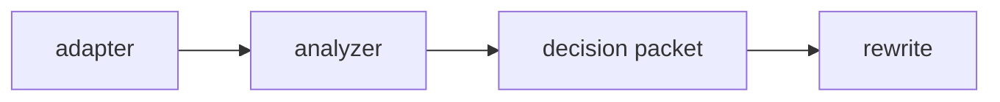
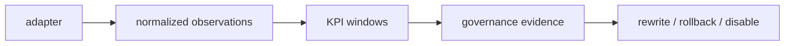

# Outcome Governance

This spec defines the split between execution-quality governance and business
outcome governance.

## Terminology

- `execution_contract`: judges whether one skill execution was high quality
- `outcome_contract`: judges whether a skill is improving or regressing against
  explicit business KPIs
- Execution evidence comes from tool trace, feedback, and evaluator scores
- Outcome evidence comes from normalized observations and KPI window summaries

## Current State

The pre-refactor loop mixed platform metrics, execution feedback, and skill
rewrites through one broad evaluation concept.

## Target State

The refactored loop keeps execution quality and business KPI evidence separate,
then reunifies them only in the governance packet.

## Required Behavior

- `serve` owns execution governance. It records execution contracts, evaluator
  scores, tool-trace evidence, and user feedback signals.
- `run` owns outcome governance. It records normalized observations, KPI window
  summaries, segment breakdowns, and exemplar slices.
- Skills only participate in run-side outcome governance when `outcome_contract`
  is defined explicitly.
- Legacy `evaluation_contract` is read as an alias of `execution_contract`.
- Legacy `outcome_metrics: true` is deprecated and must not by itself opt a
  skill into run-side governance.
- Lifecycle evidence must state whether a change was driven by execution
  quality, business KPI regression, or both.

## Data Model

- `OutcomeObservation`: `entity_id`, `timestamp`, `metrics`, `dimensions`,
  `source`, `skill_name`, `skill_version`
- `OutcomeWindowSummary`: `window`, `sample_count`, `baseline_value`,
  `current_value`, `delta`, `confidence`, `segment_breakdown`, `policy_state`
- `GovernanceEvidence`: `execution_summary`, `outcome_summary`,
  `feedback_summary`, `lifecycle_context`

## v1 Defaults

- One `outcome_contract` per skill
- `generic_csv` is the first normalized observation adapter
- Missing timestamps prevent automatic outcome rewrites instead of falling back
  to heuristic ranking
